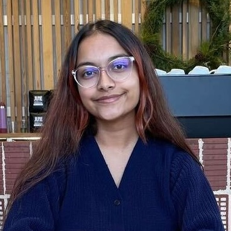

```{=html}
<style>

/* 头像样式 */
.profile {
  width: 100%;
  border-radius: 30%;
  display: block;
  background: #444;
}
.columns > .column:first-child {
  padding-right: 50px;
}
</style>
```

# Alumni

:::::::: columns
::: {.column width="20%"}
{.profile}
:::

:::::: {.column width="70%"}
<div>

<h3>Arnav</h3>
::: title
Undergraduate Student
::: 
::: interests
Kidney organoids · Kidney disease · Genomics
:::

</div>
::::::
::::::::

:::::::: columns
::: {.column width="20%"}
{.profile}
:::

:::::: {.column width="70%"}
<div>

<h3>Palak Desai</h3>
::: title
Undergraduate Student
:::

::: interests
Disease mechanisms
:::

</div>
::::::
::::::::