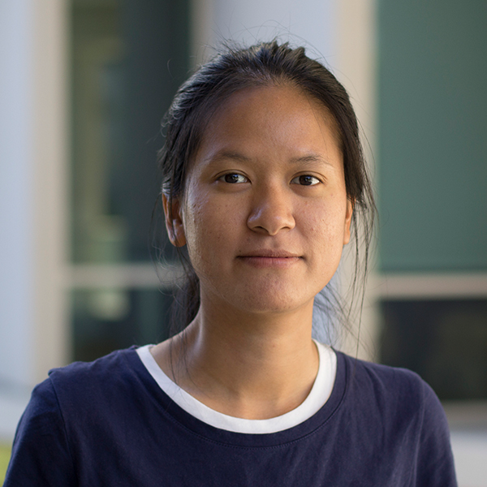

<link rel="stylesheet" href="https://cdnjs.cloudflare.com/ajax/libs/font-awesome/6.7.2/css/all.min.css">

    

```{=html}
<style>

/* 头像样式 */
.profile {
  width: 100%;
  border-radius: 30%;
  display: block;
  background: #444;
}
.columns > .column:first-child {
  padding-right: 50px;
}


.Alumni-nav{
    display:block;
    width:150px;
    margin:40px auto;
    padding:12px 24px;
    text-align:center;
    background:#2ca25f;
    color:white;
    text-decoration:none;
    border-radius:999px;
    transition:.2s;
}

.Alumni-nav:hover{
    background:#238b45;
    transform:translateY(-2px);
}


</style>
```

## Principal Investigator

::::: columns
::: {.column width="40%"}
{.profile}
:::

::: {.column width="60%"}
<div>
  <h3>Dr. Cheng Jack Song</h3>
  <div class="title">Professor</div>
  <div class="interests">Kidney organoids · Kidney disease · Genomics</div>
</div>
:::
:::::

## Staff

::::: columns
::: {.column width="40%"}
{.profile}
:::

::: {.column width="60%"}
<div>
  <h3>Trang</h3>
  <div class="title">Lab Manager</div>
  <div class="bio">Responsible for laboratory management, colony, and daily operations.</div>
</div>
:::
:::::

::::: columns
::: {.column width="40%"}
{.profile}
:::

::: {.column width="60%"}

<div>
  <h3>
    Alex 
    <a href="mailto:aig@uab.edu"><i class="fa-regular fa-envelope" style="color: #2ca25f;"></i></a>
    <a href="https://github.com/yourname" target="_blank"><i class="fa-brands fa-github" style="color: white;" ></i></a>
    <a href="https://orcid.org/0009-0008-1691-8437" target="_blank"><i class="fa-brands fa-orcid" style="color: #A6CE39;"></i></a>
    <a href="https://scholar.google.com/citations?user=your-id" target="_blank"><i class="fa-brands fa-google-scholar"></i></a>
        <!-- 
    其他社交平台
    <a href="https://www.linkedin.com/in/yourname" target="_blank"><i class="fa-brands fa-linkedin"></i></a>
    <a href="https://github.com/yourname" target="_blank"><i class="fa-brands fa-github" style="color: #ffffff;"></i></a>
    <a href="https://orcid.org/your-id" target="_blank"><i class="fa-brands fa-orcid" style="color: #A6CE39;"></i></a>
    <a href="https://scholar.google.com/citations?user=your-id" target="_blank"><i class="fa-brands fa-google-scholar" style="color: #ffffff;"></i></a>
    <a href="https://twitter.com/yourname" target="_blank"><i class="fa-brands fa-x-twitter" style="color: #000000;"></i></a>
    <a href="https://bsky.app/profile/yourname" target="_blank"><i class="fa-brands fa-bluesky" style="color: #1185FE;"></i></a>
    <a href="https://www.researchgate.net/profile/yourname" target="_blank"><i class="fa-brands fa-researchgate" style="color: #00CCBB;"></i></a>
    -->

  </h3>
  <div class="title">Research Technician</div>
  <div class="interests">Single-cell RNA-seq · Single-cell ATAC-seq · Computational biology</div>
</div>
:::
:::::


## Students

:::: person-card

<div>
  <h3>
    A
    <a href="mailto:a@uab.edu"><i class="fa-regular fa-envelope" style="color: #2ca25f;"></i></a>
    <!-- 
    <a href="https://www.linkedin.com/in/aname" target="_blank"><i class="fa-brands fa-linkedin" style="color: #0A66C2;"></i></a>
    <a href="https://github.com/aname" target="_blank"><i class="fa-brands fa-github" style="color: #ffffff;"></i></a>
    -->
  </h3>
  <div class="title">Ph.D. Student</div>
  <div class="interests">Disease mechanisms</div>
</div>
::::

<a class="Alumni-nav" href="alumni.html"> View Alumni </a>
