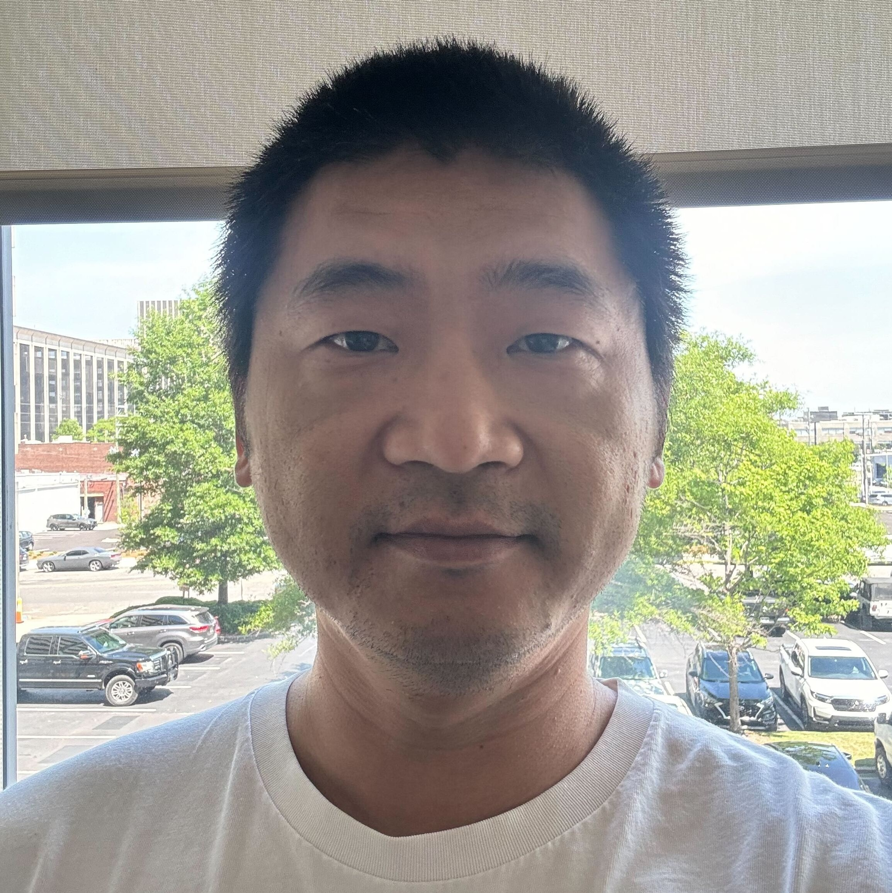
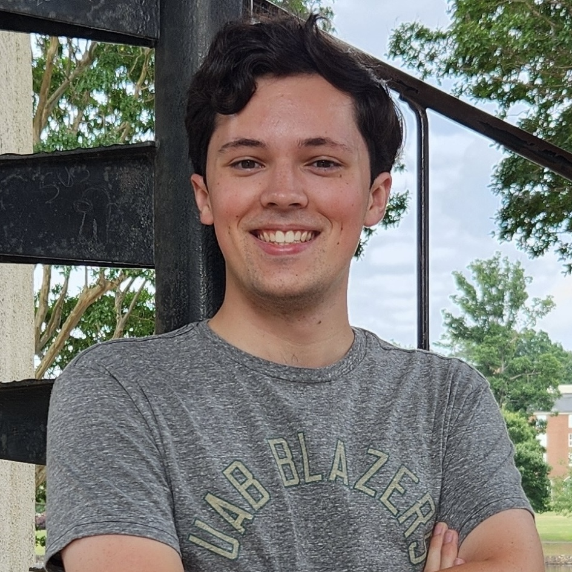
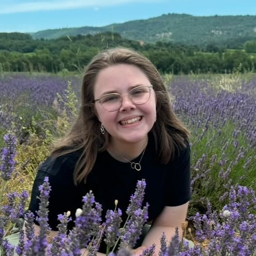
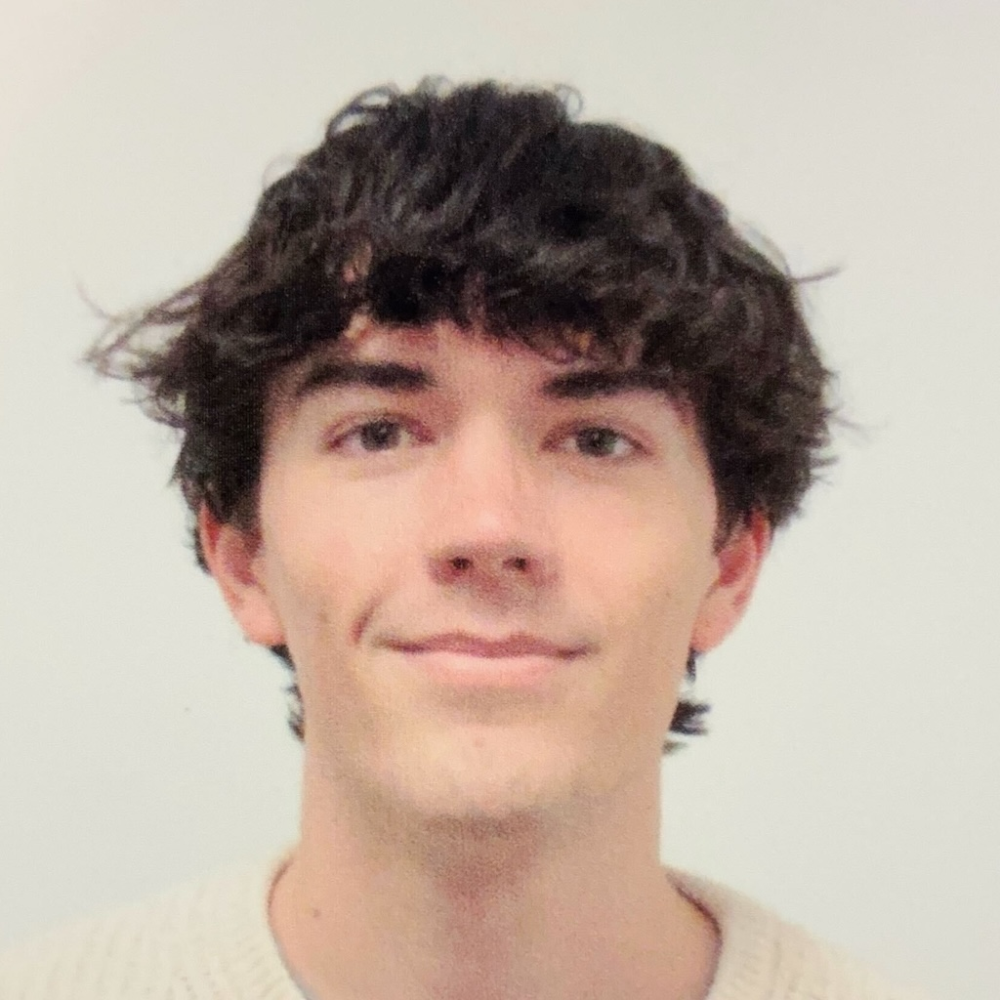

<link rel="stylesheet" href="https://cdnjs.cloudflare.com/ajax/libs/font-awesome/6.7.2/css/all.min.css">

```{=html}
<style>

/* 头像样式 */
.profile {
  width: 100%;
  border-radius: 30%;
  display: block;
  background: #444;
}
.columns > .column:first-child {
  padding-right: 50px;
}


.Alumni-nav{
    display:block;
    width:150px;
    margin:40px auto;
    padding:12px 24px;
    text-align:center;
    background:#2ca25f;
    color:white;
    text-decoration:none;
    border-radius:999px;
    transition:.2s;
}

.Alumni-nav:hover{
    background:#238b45;
    transform:translateY(-2px);
}

h2 {border-radius: 2px;
}


</style>
```

<h2>Principal Investigator</h2>

::: section-divider
:::

:::::::: columns
::: {.column width="30%"}
{.profile}
:::

:::::: {.column width="60%"}
<div>

<h3>Dr. Cheng Jack Song</h3>

::: title
Professor
:::

::: interests
Kidney organoids · Kidney disease · Genomics
:::

</div>
::::::
::::::::

## Staff

::: section-divider
:::

:::::::: columns
::: {.column width="30%"}
{.profile}
:::

:::::: {.column width="60%"}
<div>

<h3>Trang Nguyen <a href="mailto:tnguye32@uab.edu"><i class="fa-regular fa-envelope" style="color: #2ca25f;"></i></a></h3>

::: title
Lab Manager
:::

::: bio
Responsible for laboratory management, colony, and daily operations.
:::

</div>
::::::
::::::::

:::::::: columns
::: {.column width="30%"}
{.profile}
:::

:::::: {.column width="60%"}
<div>

<h3>Guoqing (Alex) Ai <a href="mailto:aig@uab.edu"><i class="fa-regular fa-envelope" style="color: #2ca25f;"></i></a> <a href="https://github.com/yourname" target="_blank"><i class="fa-brands fa-github" style="color: white;" ></i></a> <a href="https://orcid.org/0009-0008-1691-8437" target="_blank"><i class="fa-brands fa-orcid" style="color: #A6CE39;"></i></a> <a href="https://scholar.google.com/citations?user=your-id" target="_blank"><i class="fa-brands fa-google-scholar"></i></a> <!-- 
    其他社交平台
    <a href="https://www.linkedin.com/in/yourname" target="_blank"><i class="fa-brands fa-linkedin"></i></a>
    <a href="https://github.com/yourname" target="_blank"><i class="fa-brands fa-github" style="color: #ffffff;"></i></a>
    <a href="https://orcid.org/your-id" target="_blank"><i class="fa-brands fa-orcid" style="color: #A6CE39;"></i></a>
    <a href="https://scholar.google.com/citations?user=your-id" target="_blank"><i class="fa-brands fa-google-scholar" style="color: #ffffff;"></i></a>
    <a href="https://twitter.com/yourname" target="_blank"><i class="fa-brands fa-x-twitter" style="color: #000000;"></i></a>
    <a href="https://bsky.app/profile/yourname" target="_blank"><i class="fa-brands fa-bluesky" style="color: #1185FE;"></i></a>
    <a href="https://www.researchgate.net/profile/yourname" target="_blank"><i class="fa-brands fa-researchgate" style="color: #00CCBB;"></i></a>
    --></h3>

::: title
Research Technician
:::

::: bio
interests Single-cell RNA-seq · Single-cell ATAC-seq · Computational biology
:::

</div>
::::::
::::::::

## Students

::: section-divider
:::

:::::::: columns
::: {.column width="30%"}
{.profile}
:::

:::::: {.column width="60%"}
<div>

<h3>Owen Smith <a href="mailto:osmith5@uab.edu"><i class="fa-regular fa-envelope" style="color: #2ca25f;"></i></a> <!-- 
    <a href="https://www.linkedin.com/in/aname" target="_blank"><i class="fa-brands fa-linkedin" style="color: #0A66C2;"></i></a>
    <a href="https://github.com/aname" target="_blank"><i class="fa-brands fa-github" style="color: #ffffff;"></i></a>
    --></h3>

::: title
Ph.D. Student
:::

::: interests
Disease mechanisms
:::

</div>
::::::
::::::::

:::::::: columns
::: {.column width="30%"}
{.profile}
:::

:::::: {.column width="60%"}
<div>

<h3>Hayden Haupt <a href="mailto:hbhaupt@uab.edu"><i class="fa-regular fa-envelope" style="color: #2ca25f;"></i></a> <!-- 
    <a href="https://www.linkedin.com/in/aname" target="_blank"><i class="fa-brands fa-linkedin" style="color: #0A66C2;"></i></a>
    <a href="https://github.com/aname" target="_blank"><i class="fa-brands fa-github" style="color: #ffffff;"></i></a>
    --></h3>

::: title
Ph.D. Student
:::

::: interests
Disease mechanisms
:::

</div>
::::::
::::::::

:::::::: columns
::: {.column width="30%"}
{.profile}
:::

:::::: {.column width="60%"}
<div>

<h3>Torrey Flournoy <a href="mailto:Flournot@uab.edu"><i class="fa-regular fa-envelope" style="color: #2ca25f;"></i></a> <!-- 
    <a href="https://www.linkedin.com/in/aname" target="_blank"><i class="fa-brands fa-linkedin" style="color: #0A66C2;"></i></a>
    <a href="https://github.com/aname" target="_blank"><i class="fa-brands fa-github" style="color: #ffffff;"></i></a>
    --></h3>

::: title
Ph.D. Student
:::

::: interests
Disease mechanisms
:::

</div>
::::::
::::::::

:::::::: columns
::: {.column width="30%"}
{.profile}
:::

:::::: {.column width="60%"}
<div>

<h3>Ray Ding <a href="mailto:dingr@uab.edu"><i class="fa-regular fa-envelope" style="color: #2ca25f;"></i></a> <!-- 
    <a href="https://www.linkedin.com/in/aname" target="_blank"><i class="fa-brands fa-linkedin" style="color: #0A66C2;"></i></a>
    <a href="https://github.com/aname" target="_blank"><i class="fa-brands fa-github" style="color: #ffffff;"></i></a>
    --></h3>

::: title
Undergraduate Student
:::

::: interests
Disease mechanisms
:::

</div>
::::::
::::::::

:::::::: columns
::: {.column width="30%"}
{.profile}
:::

:::::: {.column width="60%"}
<div>

<h3>Mead Arabie <a href="mailto:wmarabie@uab.edu"><i class="fa-regular fa-envelope" style="color: #2ca25f;"></i></a> <!-- 
    <a href="https://www.linkedin.com/in/aname" target="_blank"><i class="fa-brands fa-linkedin" style="color: #0A66C2;"></i></a>
    <a href="https://github.com/aname" target="_blank"><i class="fa-brands fa-github" style="color: #ffffff;"></i></a>
    --></h3>

::: title
Undergraduate Student
:::

::: interests
Disease mechanisms
:::

</div>
::::::
::::::::

:::::::: columns
::: {.column width="30%"}
{.profile}
:::

:::::: {.column width="60%"}
<div>

<h3>Lauren Maxson <a href="mailto:lmmaxson@uab.edu"><i class="fa-regular fa-envelope" style="color: #2ca25f;"></i></a> <!-- 
    <a href="https://www.linkedin.com/in/aname" target="_blank"><i class="fa-brands fa-linkedin" style="color: #0A66C2;"></i></a>
    <a href="https://github.com/aname" target="_blank"><i class="fa-brands fa-github" style="color: #ffffff;"></i></a>
    --></h3>

::: title
Undergraduate Student
:::

::: interests
Disease mechanisms
:::

</div>
::::::
::::::::

:::::::: columns
::: {.column width="30%"}
{.profile}
:::

:::::: {.column width="60%"}
<div>

<h3>Omar Munir <a href="mailto:oamunir@uab.edu"><i class="fa-regular fa-envelope" style="color: #2ca25f;"></i></a> <!-- 
    <a href="https://www.linkedin.com/in/aname" target="_blank"><i class="fa-brands fa-linkedin" style="color: #0A66C2;"></i></a>
    <a href="https://github.com/aname" target="_blank"><i class="fa-brands fa-github" style="color: #ffffff;"></i></a>
    --></h3>

::: title
Undergraduate Student
:::

::: interests
Disease mechanisms
:::

</div>
::::::
::::::::

:::::::: columns
::: {.column width="30%"}
{.profile}
:::

:::::: {.column width="60%"}
<div>

<h3>Cody Serena <a href="mailto:cbserena@uab.edu"><i class="fa-regular fa-envelope" style="color: #2ca25f;"></i></a> <!-- 
    <a href="https://www.linkedin.com/in/aname" target="_blank"><i class="fa-brands fa-linkedin" style="color: #0A66C2;"></i></a>
    <a href="https://github.com/aname" target="_blank"><i class="fa-brands fa-github" style="color: #ffffff;"></i></a>
    --></h3>

::: title
Undergraduate Student
:::

::: interests
Disease mechanisms
:::

</div>
::::::
::::::::

:::::::: columns
::: {.column width="30%"}
{.profile}
:::

:::::: {.column width="60%"}
<div>

<h3>Kaiya Dixon <a href="mailto:kgdixon@uab.edu"><i class="fa-regular fa-envelope" style="color: #2ca25f;"></i></a> <!-- 
    <a href="https://www.linkedin.com/in/aname" target="_blank"><i class="fa-brands fa-linkedin" style="color: #0A66C2;"></i></a>
    <a href="https://github.com/aname" target="_blank"><i class="fa-brands fa-github" style="color: #ffffff;"></i></a>
    --></h3>

::: title
Undergraduate Student
:::

::: interests
Disease mechanisms
:::

</div>
::::::
::::::::

------------------------------------------------------------------------

<a class="Alumni-nav" href="alumni.html"> Alumni </a>
