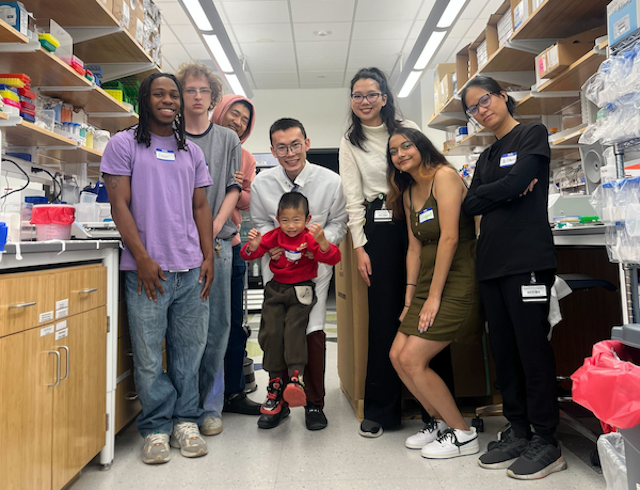

```{=html}
<style>

.hero-banner{
    position:relative;
    width:100vw;
    margin-left:calc(50% - 50vw);

}    

.hero-banner::after{
    content:"";
    position:absolute;
    inset:0;
    
}


.hero-banner img{
  width:100%;
  height:100%;
  object-fit:cover;
  display:block;    
  
}

.hero-overlay{
    position:fixed;
    top:50%;
    left:50%;
    transform:translate(-50%,-50%);
    text-align:center;
    color:white;
    width:80%;z-index:2;
}

.hero-overlay h{
    color: rgba(255, 255, 255, 0.6) !important;
    font-size:3rem;
    font-weight:700;
    text-shadow:0 3px 12px rgba(0,0,0,.6);
    margin-bottom:1rem;
}

.hero-overlay p{
    color: rgba(255, 255, 255, 0.6) !important;
    font-size:1.2rem;
    margin:0.3rem 0;
    text-shadow:0 2px 8px rgba(0,0,0,.6);
}

</style>
```

:::: hero-banner


::: hero-overlay
<h>Welcome to Song Laboratory</h>

<p>University of Alabama at Birmingham</p>

<p>Department of Cell, Developmental, and Integrative Biology</p>
:::
::::
