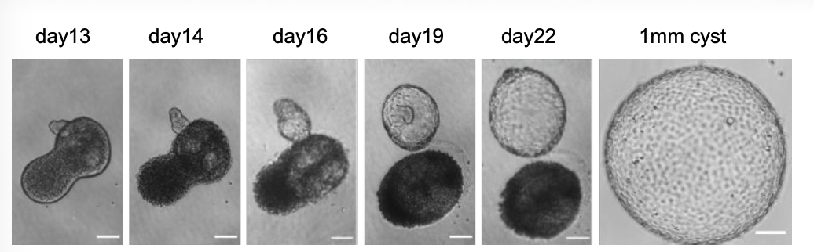

```{=html}
<style>
.research-nav{
    display:flex;
    justify-content:center;
    gap:20px;
    margin:30px 0;flex-wrap:wrap;
}

.research-nav a,
.research-nav .active-tab {
  padding: 10px 22px;
  border: 2px solid #2ca25f;
  border-radius: 999px;
  text-decoration: none;
  min-width: 120px;          /* ← 固定最小宽度 */
  text-align: center;
}

.research-nav a{
    color:#2ca25f;
}

.research-nav a:hover{
    background:#2ca25f;
    color:white;
}


</style>
```

::: research-nav
[Overview](research.qmd)

[Kidney Disease](kidney.qmd)

[Single-cell Genomics](genomics.qmd)

[Disease Modeling]{.active-tab}
:::

## Disease Modeling

::::: columns
::: {.column width="60%"}
Human kidney organoids provide a platform to study genetic mutations and disease phenotypes.
:::

::: {.column width="40%"}

:::
:::::
