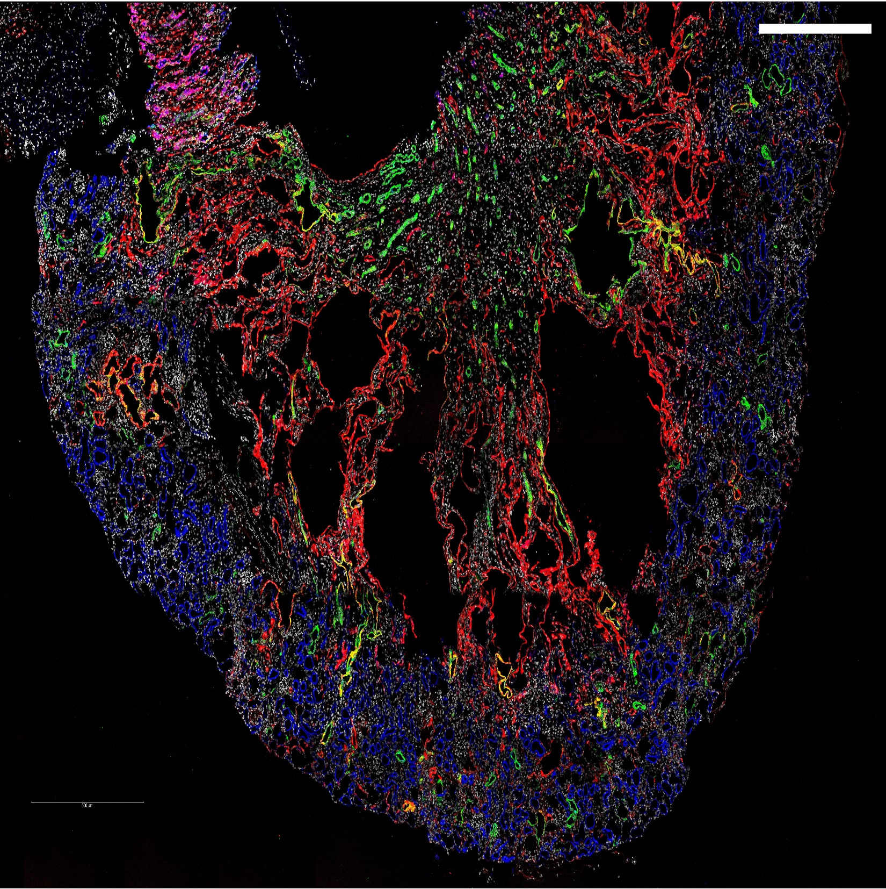

```{=html}
<style>

.research-card{
    background:#333333;
    padding:25px;
    margin:20px 0;
    border-radius:15px;
    box-shadow:0 3px 10px rgba(0,0,0,.1);
}

.research-card img{
    border-radius:12px;
}

.research-nav{
    display:flex;
    justify-content:center;
    gap:20px;
    margin:30px 0;flex-wrap:wrap;
}

.research-nav a,
.research-nav .active-tab {
  padding: 10px 22px;
  border: 2px solid #2ca25f;
  border-radius: 999px;
  text-decoration: none;
  min-width: 120px;          /* ← 固定最小宽度 */
  text-align: center;
}

.research-nav a{
    color:#2ca25f;
}

.research-nav a:hover{
    background:#2ca25f;
    color:white;
}

</style>
```

::: research-nav
[Overview]{.active-tab}

[Kidney Disease](kidney.qmd)

[Single-cell Genomics](genomics.qmd)

[Disease Modeling](modeling.qmd)
:::
## Research Overview
::::: columns
::: {.column width="70%"}


Our laboratory focuses on understanding molecular mechanisms underlying kidney disease using integrated genomic approaches. We combine single-cell transcriptomics, single-cell epigenomics, organoid models, and computational biology to investigate disease progression and therapeutic targets.
:::

::: {.column width="30%"}

:::
:::::
